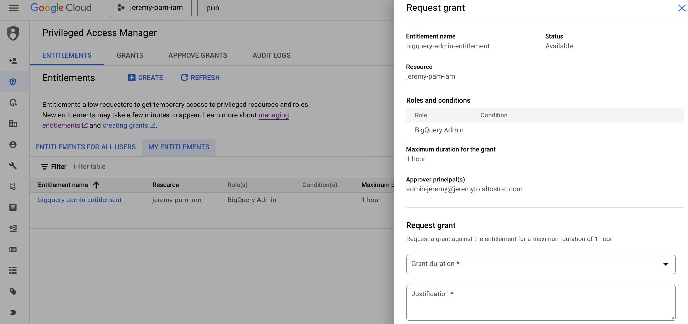
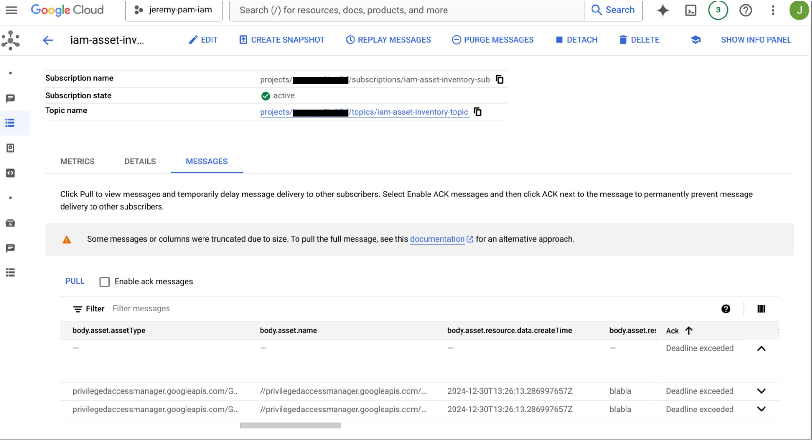

# Priviledged Access Manager activity pushed to Pub/Sub

## Setup

1. Find out your GCP project's id and number from the dashboard in the cloud console, and update the following variables in the `terraform.tfvars.json` file. Replace:

* `YOUR_PROJECT_NMR`
* `YOUR_PROJECT_ID`
* `YOUR_PROJECT_REGION`
* `YOUR_ORG_DOMAIN`
* `<user|group>:<YOUR_PRINCIPAL_EMAIL>`
* `<YOUR_ADMIN_EMAIL>`
* `<YOUR_REQUESTER_EMAIL>`
* `<YOUR_APPROVER_RECIPIENT_EMAIL>`
* `<user|group>:<YOUR_APPROVER_PRINCIPAL_EMAIL>`

with the correct values.

```shell
{
    "project_id": "YOUR_PROJECT_ID",
    "project_nmr": YOUR_PROJECT_NMR,
    "project_default_region": "YOUR_PROJECT_REGION",
    "gcp_org_domain": "YOUR_ORG_DOMAIN",
    "cloud_asset_owner_principal": "<user|group>:<YOUR_PRINCIPAL_EMAIL>",
    "eligible_users_principals": [
        "<user|group>:<YOUR_PRINCIPAL_EMAIL>"
    ],
    "additional_notification_admin": [
        "<YOUR_ADMIN_EMAIL>"
    ],
    "additional_notification_requester": [
        "<YOUR_REQUESTER_EMAIL>"
    ],
    "approver_email_recipients": [
         "<YOUR_APPROVER_RECIPIENT_EMAIL>"
    ],
    "approver_principals": [
         "<user|group>:<YOUR_APPROVER_PRINCIPAL_EMAIL>"
    ]
}
```


## Install

1. Run the following command at the root of the folder:
```shell 
$ sudo ./install.sh
$ terraform init
$ terraform plan
$ terraform apply
```

> Note: The `install.sh` script also sets the current project as the `quota` project, which is required by `cloudasset.googleapis.com` API calls.

2. In the console, under IAM & Admin => PAM, request Grant access to a role for period of time:



3. Upon submission, a Grant request will be sent to the Pub/Sub topic, and soon after can be retrieved in the attached subscription:

